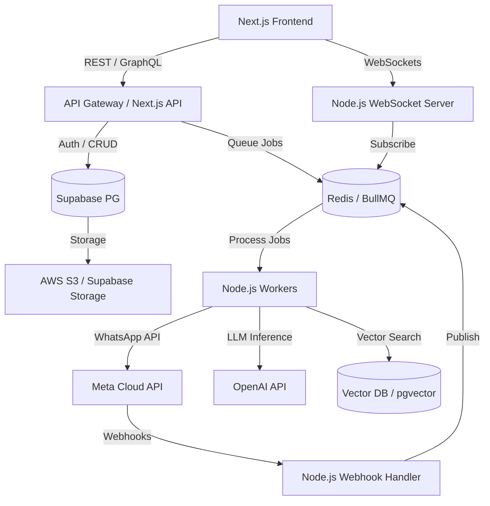
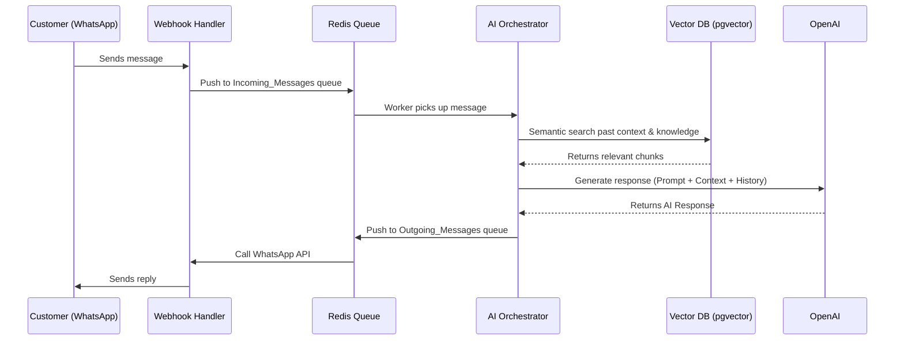

# WhatsFlow AI: Comprehensive Architecture Blueprint

## 1. Executive Summary & Core Infrastructure
WhatsFlow AI is an AI-powered SaaS platform combining WhatsApp integration, automated workflows, AI agents, and CRM functionality. 

**Core Stack:**
- **Frontend:** Next.js (App Router), Tailwind CSS, React
- **Backend:** Node.js + Express (for heavy processing, Webhook handling, and WebSockets), Next.js API Routes (for lightweight CRUD)
- **Database/Auth:** Supabase (PostgreSQL, Row Level Security, Auth, Storage)
- **Queue/Cache:** Redis + BullMQ (Background jobs, message queuing)
- **AI Integrations:** OpenAI, LangChain, Pinecone (Vector DB for Knowledge Base)
- **Hosting:** AWS (EKS/ECS for backend containers, RDS or managed Supabase, ElastiCache for Redis)

---

## 2. Global Architecture Diagram



---

## 3. Module-by-Module Integration Analysis

### 3.1 AI Agents
- **Purpose:** Manage, train, and configure AI chatbots.
- **Frontend Requirements:** Prompt editors, personality sliders, testing interface.
- **Backend Logic:** Prompt generation, RAG orchestration, function calling logic.
- **Database Design:** `ai_agents` (id, tenant_id, name, prompt, model, temperature).
- **APIs Needed:** CRUD agents, Test Agent Simulation `/api/agents/simulate`.
- **AI Features:** Direct integration with OpenAI (GPT-4o) and RAG.
- **Scaling/Security:** High token usage requires rate limiting per tenant.

### 3.2 Analytics
- **Purpose:** Provide insights on messages, leads, and agent performance.
- **Frontend Requirements:** Charts (Recharts/Chart.js), date filters.
- **Backend Logic:** Aggregation of large datasets.
- **Database Design:** Materialized views for daily metrics (`mv_daily_metrics`).
- **APIs Needed:** `/api/analytics/summary`, `/api/analytics/timeseries`.
- **Scaling:** Requires read-replicas or OLAP database (ClickHouse) if volume grows too large.

### 3.3 Automation
- **Purpose:** Visual workflow builder for automated messaging sequences.
- **Frontend Requirements:** React Flow for node-based UI.
- **Backend Logic:** State machine for workflow execution.
- **Database Design:** `workflows` (id, tenant_id, trigger, steps_json, status).
- **Queue Needed:** **Heavy BullMQ usage**. Each workflow step is a delayed or sequential job.

### 3.4 Campaigns
- **Purpose:** Send bulk WhatsApp marketing messages.
- **Backend Logic:** Chunking, batching, and handling rate limits (Meta API limits).
- **Database Design:** `campaigns` (status: pending, running, paused), `campaign_logs`.
- **Queue Needed:** Redis batch processing to respect Meta's 1000 msgs/sec tier.

### 3.5 Catalog
- **Purpose:** Manage products for WhatsApp commerce.
- **Database Design:** `products`, `product_categories`. Syncs with Meta Commerce Manager.
- **Third-party:** Meta Commerce API.

### 3.6 Channels
- **Purpose:** Connect WhatsApp Business Numbers.
- **Backend Logic:** OAuth flow with Meta, Webhook registration.
- **Database Design:** `channels` (waba_id, phone_number_id, access_token).
- **Security:** Highly sensitive. Encrypt access tokens at rest.

### 3.7 Conversations (Inbox)
- **Purpose:** Unified inbox for human + AI chats.
- **Frontend Requirements:** Real-time chat UI, typing indicators.
- **Backend Logic:** Routing messages between humans and AI.
- **Realtime:** **WebSockets (Socket.io)** required for instant delivery.
- **Database Design:** `conversations`, `messages` (sender_type: user, agent, customer).

### 3.8 Knowledge
- **Purpose:** Upload documents to train AI agents.
- **Backend Logic:** PDF parsing, chunking, embedding generation.
- **Database/AI:** `pgvector` inside Supabase OR external Pinecone.
- **Queue Needed:** Document embedding takes time; run as BullMQ background job.

### 3.9 Leads
- **Purpose:** CRM to manage contacts.
- **Frontend Requirements:** Data grid, import CSV.
- **Backend Logic:** CSV parsing, duplicate deduplication.
- **Database Design:** `contacts` (phone_number, name, tags, custom_attributes).

### 3.10 Profile & Settings
- **Purpose:** Tenant configuration, billing, team management.
- **Third-party:** Stripe for billing.
- **Database Design:** `tenants`, `users`, `tenant_users` (RBAC).

### 3.11 Support
- **Purpose:** Help center, ticketing, and reporting issues.
- **Backend Logic:** Routing tickets to support agents.
- **Database Design:** `support_tickets` (id, tenant_id, issue, status).
- **APIs Needed:** `/api/support/tickets` CRUD.

### 3.12 Templates
- **Purpose:** Create and approve WhatsApp message templates.
- **Backend Logic:** Sync with Meta's Template approval API.
- **Database Design:** `templates` (id, tenant_id, status: approved/pending/rejected).
- **Webhooks:** Listen to Meta template status changes.

### 3.13 Widget
- **Purpose:** Embeddable WhatsApp chat widget for external websites.
- **Frontend Requirements:** Lightweight iframe or JS snippet.
- **Backend Logic:** Serve widget configuration fast.
- **Database Design:** `widgets` (id, tenant_id, domain_whitelist, settings).
- **Security:** CORS policies to ensure it's only loaded on authorized domains.

---

## 4. System-Wide Feature Requirements

### Real-Time Features (WebSockets)
- **Inbox/Conversations:** Pushing new WhatsApp messages to the UI instantly.
- **Notifications:** Toast notifications for system events (e.g., CSV import finished).
- **Campaign Status:** Live progress bars for bulk sends.

### Queue / Background Jobs (Redis + BullMQ)
1. **Webhook Processing:** Offload incoming WhatsApp webhooks immediately to a queue to prevent timeouts.
2. **Campaign Dispatcher:** Send millions of messages incrementally.
3. **Document Embedding:** Chunking and vectorizing uploaded Knowledge Base files.
4. **Drip Campaigns / Automation Delays:** Scheduled jobs (e.g., "Wait 2 days, then send message").

### Authentication & Permissions (SaaS Multi-tenant)
- **Supabase Auth:** JWT-based session management.
- **RLS (Row Level Security):** EVERY table must have `tenant_id` and an RLS policy: 
  `CREATE POLICY "Isolate tenant data" ON messages USING (tenant_id = current_setting('app.current_tenant_id'));`
- **RBAC:** Admin, Agent, View-Only roles.

---

## 5. Suggested API Route Structure

```text
/server (Node.js Express - Microservice candidate)
 ├── /api/webhooks/whatsapp     -> Meta Webhooks
 ├── /api/webhooks/stripe       -> Billing Webhooks
 ├── /api/workers               -> BullMQ Dashboard & Job triggers

/app/api (Next.js App Router API - CRUD & UI logic)
 ├── /api/agents/[id]
 ├── /api/conversations/[id]/messages
 ├── /api/campaigns/launch
 ├── /api/knowledge/upload
```

---

## 6. Recommended PostgreSQL Schema (Core Tables)

```sql
-- Tenants & Users
CREATE TABLE tenants (
    id UUID PRIMARY KEY,
    name VARCHAR,
    stripe_customer_id VARCHAR,
    created_at TIMESTAMP DEFAULT NOW()
);

CREATE TABLE users (
    id UUID REFERENCES auth.users,
    tenant_id UUID REFERENCES tenants(id),
    role VARCHAR(50) -- 'admin', 'agent'
);

-- Core CRM & Messaging
CREATE TABLE contacts (
    id UUID PRIMARY KEY,
    tenant_id UUID REFERENCES tenants(id),
    phone VARCHAR(20),
    name VARCHAR,
    opted_in BOOLEAN DEFAULT TRUE
);

CREATE TABLE conversations (
    id UUID PRIMARY KEY,
    tenant_id UUID REFERENCES tenants(id),
    contact_id UUID REFERENCES contacts(id),
    status VARCHAR(20), -- 'open', 'resolved', 'bot_handled'
    assigned_to UUID REFERENCES users(id)
);

CREATE TABLE messages (
    id UUID PRIMARY KEY,
    conversation_id UUID REFERENCES conversations(id),
    direction VARCHAR(10), -- 'inbound', 'outbound'
    content TEXT,
    message_type VARCHAR(20), -- 'text', 'template', 'image'
    wa_message_id VARCHAR,
    status VARCHAR(20) -- 'sent', 'delivered', 'read'
);
```

---

## 7. AI Orchestration Layer Design



---

## 8. Potential Bottlenecks & Scaling Risks

1. **Webhook Throttling:** Meta requires webhook endpoints to respond in < 200ms. *Solution:* API Gateway immediately returns 200 OK and pushes the payload to Redis.
2. **Database Connection Limits:** Serverless Next.js can exhaust DB connections. *Solution:* Use Supabase PgBouncer (Connection Pooling).
3. **LLM Latency:** OpenAI API can take 2-5 seconds. *Solution:* Use streaming where possible, or inform users via WhatsApp typing indicators.
4. **Vector DB Size:** Scaling `pgvector` inside Supabase can get expensive. *Solution:* Offload to a dedicated Pinecone/Weaviate cluster when crossing 1M vectors.
5. **Noisy Neighbor Problem:** One tenant sending a massive campaign blocking other tenants. *Solution:* Implement Fair Queueing in BullMQ (tenant-level rate limits).

---

## 9. Security Risks & Mitigation
- **Prompt Injection:** Customers might trick the AI into giving discounts. *Mitigation:* System prompt guards, output validation layers.
- **PII Leakage:** WhatsApp messages contain names and numbers. *Mitigation:* Encrypt at rest, do not send PII to OpenAI unless necessary (masking).
- **Tenant Data Bleed:** *Mitigation:* Strict PostgreSQL Row Level Security (RLS) is non-negotiable.

## 10. Microservices Evolution
**Start as a Majestic Monolith (Next.js + 1 Express Node).** As you scale, break out these specific functions into microservices:
1. **Webhook Ingestion Service** (High throughput, lightweight Go or Rust service).
2. **AI Inference Service** (Python FastAPI for better LLM tooling if moving away from standard OpenAI).
3. **Campaign Dispatcher** (Dedicated background workers).
